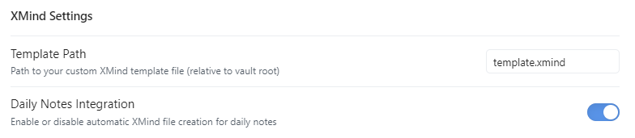
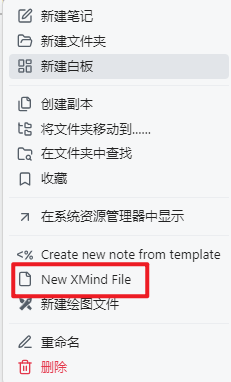
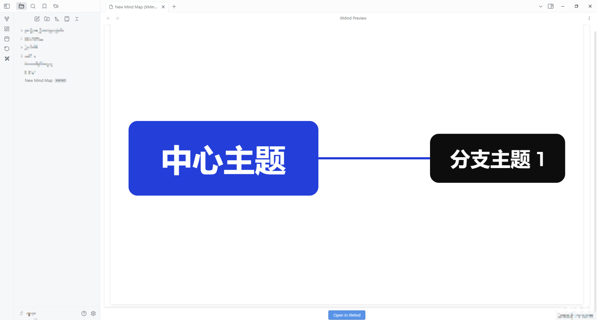

# Obsidian XMind Plugin

This plugin integrates XMind functionality into Obsidian, allowing you to create, preview, and open XMind mind maps directly within your Obsidian vault.

## Features

- 📝 Create new XMind files directly from Obsidian's file explorer
- 👀 Preview XMind files with thumbnails in Obsidian
- 🚀 Open XMind files with your system's default application
- 📋 Support for custom templates
- 🎨 Beautiful preview interface with thumbnails

## Screenshots

### Plugin Settings

### Creating New XMind File

### XMind Preview Interface

## Installation

1. Download the latest release from the releases page
2. Enable the plugin in Obsidian's settings

## Usage

### Creating New XMind Files

0. Set Template xmind file

1. Right-click on a folder or file in the file explorer
2. Select "New XMind File"
3. A new XMind file will be created:
   - If you right-click a folder, the file will be created inside that folder
   - If you right-click a file, the new file will be created in the same folder
4. When the “Daily Note Integration” feature is enabled, a new XMind file will be created with the same name as the daily note.

### Opening XMind Files

Click the "Open in XMind" button in the preview pane to open the file with your system's default XMind application.

## Preview Features

- Automatic thumbnail generation from XMind files
- Clean and modern interface
- Quick access button to open files
- Responsive design that adapts to your window size

## Support

If you encounter any issues or have suggestions, please:
1. Ensure XMind is properly installed and set as the default application for .xmind files
2. Check if you have the necessary permissions to access the files
3. Create an issue in the GitHub repository

## License

MIT License - see LICENSE file for details
